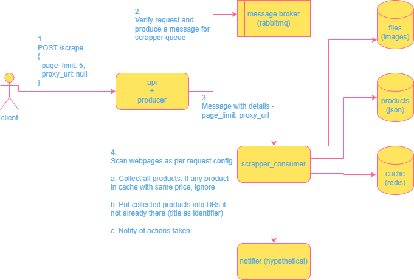

# Python Web Scrapper
https://goatlys.notion.site/BE-engineer-testing-assigment-f1890cf18af343f7b737ee95575f98dd


## Architecture




## Project Structure
```
/
├── app/
│   ├── api/
│   │   ├── __init__.py
│   │   └── endpoints.py                              # API endpoints e.g. /scrape
│   ├── consumers/
│   │   ├── __init__.py
│   │   ├── rmq_consumer.py                           # RabbitMQ consumer base class
│   │   └── scrapper_consumer.py                      # Consumer for scraping products, processes scrape requests in background
│   ├── db/
│   │   ├── __init__.py
│   │   └── models/
│   │       ├── __init__.py
│   │       └── product.py                            # Product model, to validate, store scraped products details like title, price, image_path
│   ├── producers/
│   │   ├── __init__.py
│   │   ├── rmq_producer.py                           # RabbitMQ producer base class
│   │   └── scrapper_producer.py                      # Contains logic to push scrape requests to RabbitMQ
│   ├── schemas/
│   │   ├── __init__.py
│   │   └── scape_request.py                          # Scrape request schema, has page_limit and proxy_url
│   ├── services/
│   │   ├── __init__.py
│   │   ├── notifications/
│   │   │   ├── __init__.py
│   │   │   ├── notifier.py                           # Base notifier class
│   │   │   └── print_notifier.py                     # Prints notifications to console
│   │   ├── scrappers/
│   │   │   ├── __init__.py
│   │   │   ├── dentalstall_products_scrapper.py      # Scrapes products from dentalstall.com, caches them in Redis and images in disk
│   │   │   └── products_scrapper.py                  # Products scrapper base class
│   │   └── storage/
│   │       ├── __init__.py
│   │       ├── cache_storage.py                      # Cache storage, stores data in Redis
│   │       ├── files_storage.py                      # Files storage, stores files in disk
│   │       ├── json_array_file_storage.py            # JSON array file storage, stores products in JSON file with array as top level type
│   │       └── storage.py                            # Base storage class
│   └── utils/
│       ├── __init__.py
│       └── auth_utils.py                             # Contains logic to validate token (which is defined as env key `AUTH_TOKEN` in .env file)
├── architecture.drawio.png                           # Architecture diagram
├── config/
│   └── __init__.py                                   # Config/settings validations for .env file
├── data/                                             # Data folder
│   ├── images/                                       # Images folder
│   │   └── https%3A%2F%2Fdentalstall.com%2Fwp-content%2Fuploads%2F2021%2F05%2F3M-ESPE-Filtek-Z250-XT-Nano-Hybrid-1-300x300.jpg
│   └── products.json                                 # Products JSON file, contains scraped products details
├── docker-compose.yaml                               # Docker Compose file for running the app
├── Dockerfile
├── .env                                              # Environment variables values as defined in `config/__init__.py`
├── example.py                                        # Example usage of the app
├── README.md
├── requirements.txt
└── tests/                                            # Unit tests
    └── __init__.py
```


## Usage

1. `docker compose up`
2. Wait till the app is up and running^
3. `python example.py`


`example.py` contains a sample usage of the APIs.
```python
import httpx

response = httpx.get(
    url="http://localhost:80/",
    timeout=30,
)
print(response.status_code)
print(response.text)


response = httpx.post(
    url="http://localhost:80/scrape/",
    json={
        "page_limit": 2,
    },
    headers={
        "Authorization": "Bearer 1234567890"
    },
    timeout=30,
)
print(response.status_code)
print(response.text)
```

### Output of `example.py`
```shell
200
{"message":"Hello World!"}
200
{"status":"ok"}
```

### Output of docker environment
```log
rabbitmq           | 2024-11-08 18:40:22.240 [info] <0.728.0> Closing all channels from connection '172.19.0.5:36090 -> 172.19.0.3:5672' because it has been closed        
scrapper_consumer  | Received scrape request: page_limit=2 proxy_url=None
api                | INFO:     172.19.0.1:59764 - "POST /scrape/ HTTP/1.1" 200 OK
scrapper_consumer  | Scraping page 1
scrapper_consumer  | Price changed or does not exist for product in cache: 1 x GDC Extraction Forceps Lo...
scrapper_consumer  | Found product with title: 1 x GDC Extraction Forceps Lo...
scrapper_consumer  | Price changed or does not exist for product in cache: 3A MEDES Bleaching And Night ...
scrapper_consumer  | Found product with title: 3A MEDES Bleaching And Night ...
...
...
...
scrapper_consumer  | Found product with title: 3m Espe Sof-Lex Spiral Wheels...
scrapper_consumer  | [Notification] Scraped 54 products. Updated 33 products.
```

### Output of `data/products.json`
```json
[
    {
        "title": "3M ESPE Restorative Introduct...",
        "price": 4395.0,
        "image_path": "https%3A%2F%2Fdentalstall.com%2Fwp-content%2Fuploads%2F2023%2F01%2F03-44-700x700-1-300x300.jpg"
    },
    {
        "title": "3M Espe Retraction Capsule...",
        "price": 5395.0,
        "image_path": "https%3A%2F%2Fdentalstall.com%2Fwp-content%2Fuploads%2F2021%2F12%2F3M-Espe-Retraction-Capsule.-3-300x300.jpg"
    },
...
```